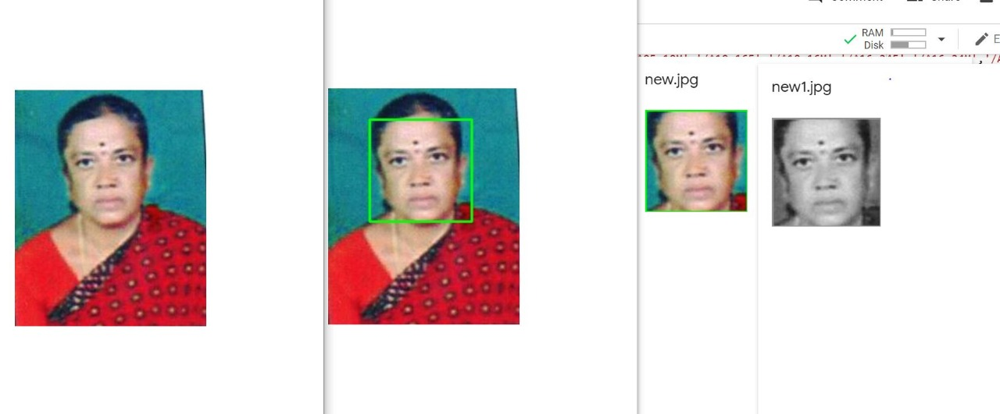
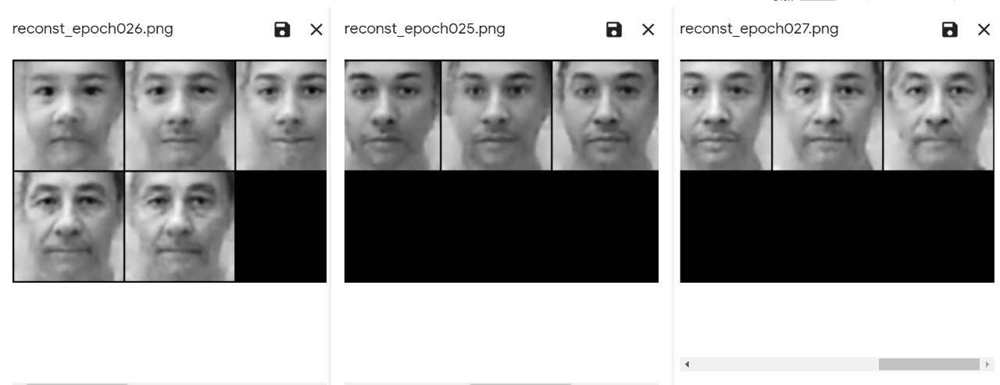

# KSP-IPH2019-Table39
### India Police Hackathon '19 

### Topic: Facial Recognition
### Team Name: Age is just a number

## Project Synopsis:
Solving cases of missing people are particularly hard. As more years pass and as we age, our face structure changes. Facial recognition is almost impossible here. To combat this, we suggest creating an aged data set from our existing data set of missing subject cases using Generative Adversarial Networks. By simulating aging, we can then compare any photo taken on sighting with this aged data set. If we know the approximate age, we can check only that subset of the aged data set. Otherwise, we can run a search through the entire aged data set. Thus we can recognize subjects real-time whether they have been missing for a few days, or for many years.

### List of tools:
Google Colab
Python 3, Runtime - GPU

## Steps followed(Code with output):
### For facial recognition
As seen in the [attachment](/Proof.ipynb) there is a requirement of estimating aging in facial recognition. Here we can see that a younger version of a person does not match the same person after a few years because of changes in the facial structure.

Step 1.
We need to compare known images with missing images.
There are three known databases - Arrested, Wanted, Dead
This is [deposited](/merging.ipynb) into a single folder known_images.

Step 2.
The [known](/known.csv) and [unknown](/unknown.csv) encoding data(specific facial features) are uploaded in a csv file.

Step 3. 
We need to search known_images and [identify missing_images](/Facialrec.ipynb) by comparing the encoding data present in the csv files.

### For aging
Step 4.
We [divide the missing_images into folders according to their age](folders_for_police.ipynb), referencing the metadata. The result is attached [here.](/police_db1.zip)

Step 5.
We preprocess each image. This identifies faces, isolates, crops, resizes to (128,128), and converts RGB image to greyscale.

  

Step 6.
We [train the images](/Training_Final.ipynb). The resultant output after every epoch is given below.

  

Step 7. 
We form a new database by [running the trained model](/Testing.ipynb) on missing_images. Each image is aged and deposited into the respective age folder. Thus we get a copy of the aged image in every age folder.

Apart from doing this with the missing_images, we also validating this with a celebrity database UTKFace. We segregated only Indians to get a refined output and this folder is zipped and [uploaded.](/aged_celeb_ds.zip)

Step 8.
When we input an image of a person who we think may be missing, their gender and approximate age, it is compared to the subset of aged data set. If there is a match, the image is that of a missing person. 

# Result
Our matches are [uploaded.](/matches_missing.xlsx)

